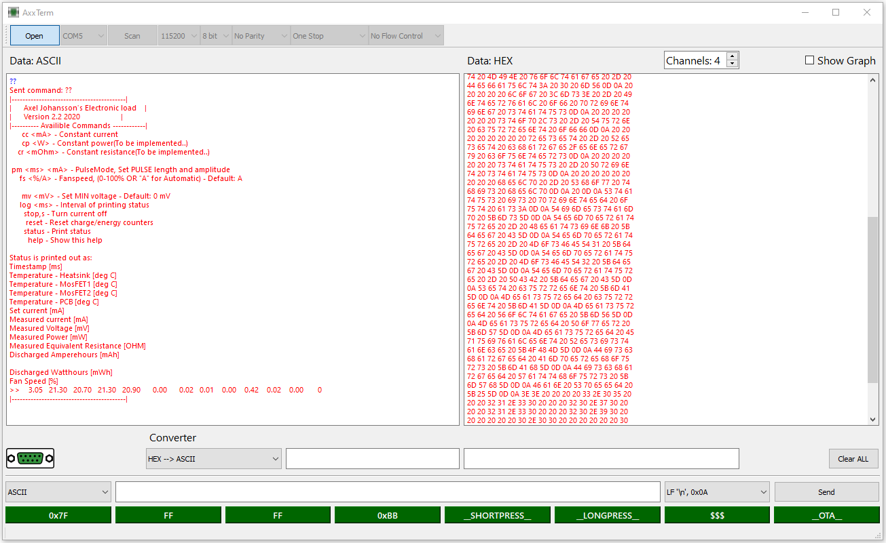

# AxxTerm

Serial terminal with dual ASCII/HEX view, real-time plotting, data converter, and configurable macro buttons.



## Features

- **Dual data view** - ASCII and HEX side by side, color-coded (red = received, blue = sent)
- **Real-time plotting** - Graph incoming data with 1-12 channels, auto-scaling Y axis, and adjustable plot length
- **Send modes** - ASCII, HEX, and Binary with configurable line endings (LF, CR, CRLF)
- **Macro buttons** - 8 quick-send buttons, right-click to edit label and payload
- **Data converter** - Convert between HEX, ASCII, Decimal, and Binary
- **Serial configuration** - Baud rate, data bits, parity, stop bits, flow control

## Requirements

- Python 3.8+
- PyQt5
- pyqtgraph
- NumPy

## Installation

### Run from source

```bash
pip install -r requirements.txt
python AxxTerm_serial.py
```

### Build standalone .exe (no Python needed on target machine)

```bash
build.bat
```

This installs PyInstaller if needed, then creates `dist\AxxTerm.exe` - a single portable executable. Copy it anywhere and run.

You can also build manually:

```bash
pip install pyinstaller
pyinstaller --onefile --windowed --name AxxTerm --clean AxxTerm_serial.py
```

## Usage

### Connecting

1. Select the COM port from the dropdown (click **Scan** to refresh the list)
2. Set baud rate (default 115200) and serial parameters (data bits, parity, stop bits, flow control)
3. Click **Open** to connect - the DB-9 connector icon turns green when connected

### Sending data

- Type in the input field and press **Enter** or click **Send**
- Select **ASCII**, **HEX**, or **BINARY** mode from the dropdown on the left
- Select line ending from the dropdown on the right (LF, CR, CRLF, or none)
- Use **Up/Down arrows** to navigate send history

### Macro buttons

The 8 green buttons at the bottom send pre-configured hex data with a single click.

- **Right-click** any macro button to edit it
- Set a custom label and payload using HEX, ASCII, Decimal, or Binary input
- Macros are saved automatically to `macros.json` next to the application

### Real-time plotting

1. Check **Show Graph** to enable the plot
2. Set the number of channels with the **Ch** spinner (1-12)
3. Set the scrolling window size with the **Pts** spinner

The plotter accepts incoming serial data in several formats:

| Format | Example |
|--------|---------|
| Tab-separated | `1.0\t2.0\t3.0` |
| Comma-separated | `1.0,2.0,3.0` |
| Space-separated | `1.0 2.0 3.0` |
| Labeled | `temp:23.5\thum:45.2\tpres:1013` |

Each line (terminated by `\n`) is parsed and plotted. Values beyond the configured channel count are ignored.

### Data converter

The converter at the bottom converts between HEX, ASCII, Decimal, and Binary in real time. Select the conversion type from the dropdown and type in the left field - the result appears in the right field. Changing the conversion type re-converts the current input automatically.

## Files

| File | Description |
|------|-------------|
| `AxxTerm_serial.py` | Main application source |
| `requirements.txt` | Python dependencies |
| `build.bat` | Build script for standalone .exe |
| `macros.json` | Macro button config (auto-created on first edit) |

## License

See [LICENSE](LICENSE) for details.
