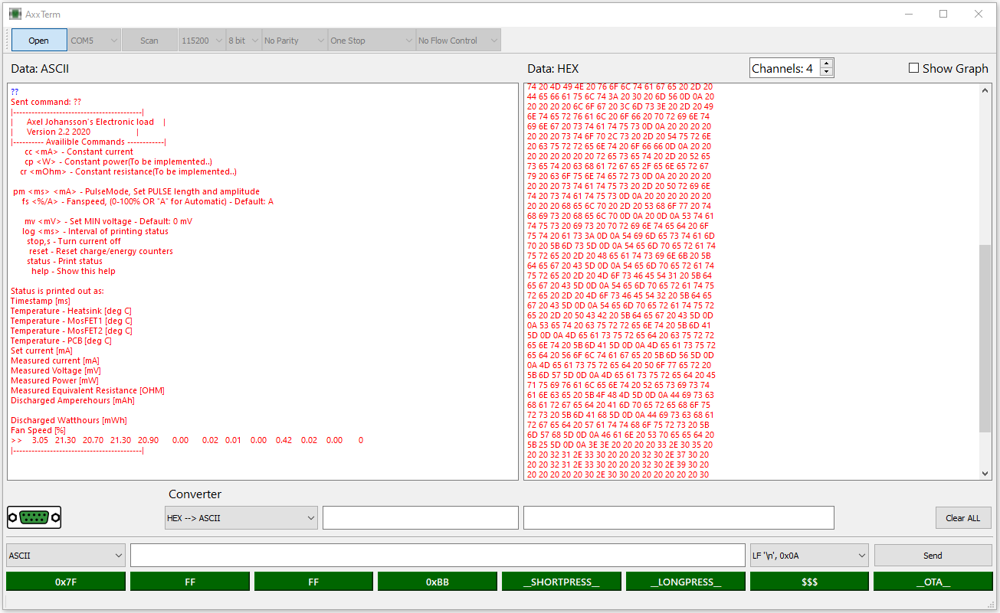

# AxxTerm

A professional serial terminal with dual ASCII/HEX view, real-time plotting, binary/frame decoding, data converter, and configurable macro buttons. Built with Python and PyQt5.



## Features

### Serial Communication
- Auto-detect serial ports with device name and VID:PID display
- Configurable baud rate (9600 to 921600), data bits, parity, stop bits, flow control
- Visual connection indicator (DB-9 connector icon: green = connected, red = disconnected)
- Live status bar with RX/TX throughput (bytes/sec), totals, and baud rate

### Dual Data View
- ASCII and HEX views side by side, updated in real-time
- Color-coded: red for received data, blue for sent data
- Resizable splitter between the plot and data views

### Sending Data
- Three send modes: ASCII, HEX, BINARY
- Configurable line endings: None, LF, CR, CR+LF
- Command history with Up/Down arrow keys
- 8 macro buttons for quick-send (right-click to edit label and payload)

### Real-Time Plotting
- 1 to 12 channels with auto-scaling Y-axis
- Configurable scrolling window (10 to 10,000 points)
- Crosshair cursor showing all channel values at the mouse position
- Right-click legend entries to rename channels or change colors
- Right-click plot area for axis settings (auto-range, manual Y-axis limits)
- Clear Plot button to reset all data
- Export plot as PNG image
- Export plot data as CSV with channel name headers

### Data Decoding Modes

**ASCII** (default) -- Parses newline-delimited text values for plotting.

| Delimiter | Example |
|-----------|---------|
| Auto-detect | Detects tab, comma, semicolon, or space |
| Comma | `1.0,2.0,3.0` |
| Semicolon | `1.0;2.0;3.0` |
| Space | `1.0 2.0 3.0` |
| Tab | `1.0\t2.0\t3.0` |
| Other | User-defined custom delimiter |

Supports labeled values (e.g., `temp:23.5,hum:45.2`).

**Binary Stream** -- Decodes continuous raw binary data.

| Setting | Options |
|---------|---------|
| Data Type | uint8, int8, uint16, int16, uint32, int32, float32, double64 |
| Endianness | Little Endian, Big Endian |
| Sync | Button to re-align stream |

Each sample is `channels x sizeof(type)` bytes. In this mode, the left panel shows color-coded decoded channel values.

**Custom Frame** -- Decodes framed binary packets.

Frame structure: `[Start Byte(s)] [Optional Size Field] [Payload] [Optional Checksum]`

| Setting | Options |
|---------|---------|
| Start byte | Variable-length hex sequence (e.g., `AA BB`) |
| Payload Size | Fixed (user-specified), 1-byte size field, 2-byte size field |
| Data Type | Same 8 types as Binary Stream |
| Endianness | Little Endian, Big Endian |
| Checksum | Optional 8-bit sum validation |

### Data Converter
- Real-time conversion between HEX, ASCII, Decimal, and Binary
- 12 conversion combinations
- Input/output with arrow indicator

### Settings Persistence
- All settings saved automatically to `AxxTerm_settings.json`
- Includes: serial port config, decode mode, plot settings, channel names/colors, macros
- File > Save Settings / Load Settings for explicit save/load to custom files

### Keyboard Shortcuts

| Shortcut | Action |
|----------|--------|
| Enter | Send data |
| Up/Down | Navigate send history |
| Ctrl+S | Save settings to file |
| Ctrl+O | Load settings from file |
| Ctrl+Q | Quit |

## Requirements

- Python 3.8+
- PyQt5 >= 5.15
- pyqtgraph >= 0.13
- NumPy >= 1.24

## Installation

```bash
git clone https://github.com/AxxAxx/AxxTerm.git
cd AxxTerm
pip install -r requirements.txt
python AxxTerm.py
```

## Building Standalone .exe

### Using the build script (Windows)

```bash
build.bat
```

This installs PyInstaller if needed, then creates `dist\AxxTerm.exe` -- a single portable executable. Copy it anywhere and run. No Python installation needed on the target machine.

### Manual build

```bash
pip install pyinstaller
pyinstaller --onefile --windowed --name AxxTerm --clean AxxTerm.py
```

The resulting executable is in the `dist/` folder.

### Build notes

- The .exe resolves config files (settings, macros) relative to the executable location, not the temp folder
- First launch creates `AxxTerm_settings.json` next to the executable when you change any setting
- File size is typically 30-50 MB (includes Python runtime and all dependencies)

## File Structure

| File | Description |
|------|-------------|
| `AxxTerm.py` | Main application (single-file, self-contained) |
| `requirements.txt` | Python dependencies |
| `build.bat` | Windows build script for standalone .exe |
| `AxxTerm_GUI.PNG` | Screenshot |
| `LICENSE` | MIT License |

## Settings File Format

`AxxTerm_settings.json` is auto-created and contains:

```json
{
  "plot": {
    "mode": "ASCII",
    "num_channels": 4,
    "num_points": 100,
    "show_plot": false,
    "delimiter": "Auto",
    "channel_names": {},
    "channel_colors": {},
    "y_auto_scale": true,
    "binary": { "data_type": "float32", "endianness": "little" },
    "frame": { "sync_word": "AA", "size_field": "fixed", "frame_size": 12, "checksum": false }
  },
  "serial": {
    "baud_rate": "115200",
    "data_bits": 3,
    "parity": 0,
    "stop_bits": 0,
    "flow_control": 0
  },
  "macros": [
    { "label": "0x7F", "hex": "7F" }
  ]
}
```

## License

MIT License. See [LICENSE](LICENSE) for details.
